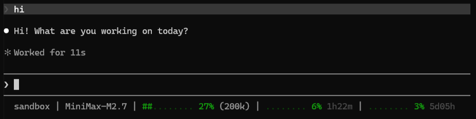
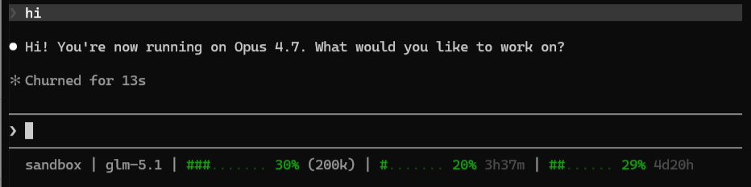

# 🔁 CC‑TPR – Claude Code Token Plan Router

## Stop paying a premium for a brand label.

👉 **This router offers more than 10x the mileage and about 95% of the performance of Claude Pro at only $28 per month.**

This router lets Claude Code use **Minimax M2.7** (beats Sonnet 4.6 on SWE‑bench) and **ZAI GLM-5.1** (ties/beats Opus 4.6 on hardest coding benchmarks) – while automatically routing to **DeepSeek V4 Pro** (1M context) when your conversation approaches 200k tokens.

---

## 💰 Real cost breakdown (no hidden maths)

| Plan | Monthly cost | Notes |
|------|--------------|-------|
| Claude Pro (Sonnet + Opus) | $20 | Low usage ceiling |
| MiniMax Starter (M2.7) | $10 | 1,500 requests / 5h |
| Z.AI Lite (GLM‑5.1) | $18 | ~80 prompts / 5h |
| **Subtotal (replaces Claude Pro)** | **$28** | That’s **$8 more** than Claude Pro |
| DeepSeek V4 Pro (1M context) | **$0/month** + initial $2 min. | Pay as you use – typical <$2/month |

> **Important:** DeepSeek V4 Pro is **not** included in the $28. A **minimum first‑time payment of $2** is required to access the model. After that, you pay only for what you use – **no monthly subscription**. For most users, that $2 lasts for months.

So your **monthly commitment** is $28 (MiniMax + Z.AI). DeepSeek is a rare, cheap emergency parachute.

---

## 📸 Real‑time status line (what you see while using Claude Code)




*left to right: directory | actual active model | context window | 5hr quota & reset countdown | weekly quota & reset countdown*

---

## 🧠 Why this router exists

Claude Pro charges $20/month for barely enough usage to build anything substancial. 

| Model | SWE‑bench Verified | SWE‑bench Pro | API cost (per 1M output) |
|-------|--------------------|----------------|---------------------------|
| Claude Sonnet 4.6 | 55% | – | ~$15.00 |
| **MiniMax M2.7** | **78%** | – | ~$1.20 (12.5x cheaper) |
| Claude Opus 4.6 | – | 57.3% | ~$25.00 |
| **Z.AI GLM‑5.1** | – | **58.4%** (🥇 top spot) | ~$3.10 (5.7x cheaper) |

**The router gives you the best of both worlds** – M2.7 for daily coding, GLM‑5.1 for hard planning, plus a 1M‑token emergency brake via DeepSeek when context exceeds 200k.

---

## 🔗 Referral links – how you keep this project alive

We don't charge for the router. The only way we afford to maintain it is through referral commissions when you sign up for the required plans.

✅ **You pay exactly the same price** – no markup, no fake bonuses.  
✅ **We get a small commission** that pays for development.  
✅ **If everyone signs up directly, this project dies.** If you find value in CC‑TPR, please use the links below.

| Plan | Direct link (supports us) |
|------|----------------------------|
| MiniMax Coding Plan (M2.7) | [https://platform.minimax.io/subscribe/token-plan?code=VaYpkbSg4M](https://platform.minimax.io/subscribe/token-plan?code=VaYpkbSg4M) |
| Z.AI GLM Token Plan (GLM‑5.1) | [https://z.ai/subscribe?ic=ER6MB4WO5C](https://z.ai/subscribe?ic=ER6MB4WO5C) |

> *Already subscribed? You can still help by giving our github repo a star*

---

## 📊 Why M2.7 over Sonnet? (MiniMax)

| Metric | M2.7 | Sonnet 4.6 | Real‑world impact |
|--------|------|------------|--------------------|
| SWE‑bench Verified | **78%** | 55% | 23% fewer bug‑fix loops |
| Toolathon (tool use) | 46.3% | – | Reliable agentic behaviour |
| Hallucination rate | **34%** | 46% | Less confident nonsense |
| Self‑optimisation | **100+ rounds, +30%** | Not designed for it | Can improve its own code |

**Minimax Starter Token Plan ($10)** gives you 1,500 requests per 5h – enough for 650M tokens/month in my real‑world use.

👉 [Get MiniMax via our referral link](https://platform.minimax.io/subscribe/token-plan?code=VaYpkbSg4M)

---

## 🧩 Why GLM‑5.1 over Opus? (Z.AI)

| Metric | GLM‑5.1 | Opus 4.6 | Winner |
|--------|---------|----------|--------|
| SWE‑bench Pro | **58.4%** (🥇 top spot) | 57.3% | GLM |
| Terminal‑Bench 2.0 | **69.0** | 65.4 | GLM |
| AIME 2026 (math) | **95.3** | ~88% | GLM |
| GPQA (science) | 86.2 | 91.3 | Opus (rarely used) |
| Max autonomous steps | **1,200+** | – | GLM |

Conclusion: For 94.6% of coding tasks, GLM‑5.1 is indistinguishable from Opus – and it actually leads on the hardest engineering benchmark.

**The GLM Coding Lite ($18)** gives ~3x the prompts of Claude Pro.

👉 [Get Z.AI GLM via our referral link](https://z.ai/subscribe?ic=ER6MB4WO5C)

---

## ⚙️ How the 200k‑context fallback works (DeepSeek V4 Pro)

- MiniMax and GLM both have a **200k token context window**.
- When your conversation reaches **165k tokens**, the router pre‑emptively switches Sonnet & Opus to **DeepSeek V4 Pro** (1M context).
- DeepSeek is **pay‑as‑you‑go** – you make a **minimum first‑time payment of $2** to unlock the model. After that, you add credits as needed (no monthly fee).
- Most users spend **less than $2/month** on DeepSeek, because large contexts are rare.

---

## 🛠️ Quick start (Windows)

1. **Clone the repo**  
2. **Double‑click `start-router.bat`** – a CMD window opens with the router running.  
3. **Start Claude Code** as usual – it will automatically route through the proxy.  
4. **Close the CMD window** or press `Ctrl+C` when done.

---

## 📁 Configuration

| File | Purpose |
|------|---------|
| `config.yaml` | Model routing rules, context threshold (default 165k), timeouts |
| `.env` (copy from `.env.example`) | API keys: `MINIMAX_API_KEY`, `ZAI_API_KEY`, `DEEPSEEK_API_KEY`, `OPENROUTER_API_KEY` |

---

## 🧪 Development

```bash
python -m venv .venv
.venv\Scripts\python.exe -m pip install -e ".[dev]"
pytest
pyright
python -m src.main
```

---

## 📜 License

MIT – free for any use, including commercial.

---

## ❓ FAQ

**Q: Do I really need both plans?**  
A: You could use only MiniMax (replaces Sonnet & Haiku) and skip GLM. But GLM is only $18 and gives Opus‑class reasoning – worth it for planning/architecture/review.

**Q: What if I never hit 200k context?**  
A: Then you never pay DeepSeek beyond the initial $2 deposit. Your monthly stays at $28.

**Q: Why not just use OpenRouter directly?**  
A: OpenRouter doesn’t give you token‑plan pricing. Our router uses **monthly subscription plans** (MiniMax, Z.AI) which are ~10x cheaper than pay‑as‑you‑go API.

---

